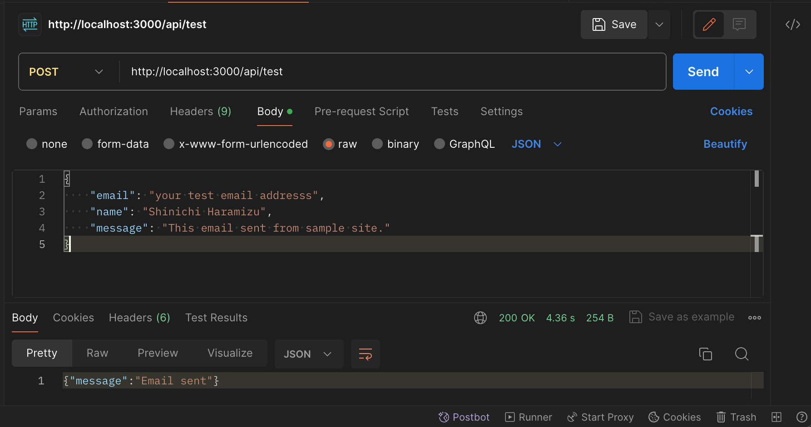

# React Email with Sitecore Send / Moosend

I have prepared a sample email using React Email that is sent via the Sitecore Send / Moosend SMTP Service.

## What is this tool made of?

- [React Email](https://react.email/) 2.0.0
- [Nodemailer](https://nodemailer.com/) 6.9.9
- [Next.js](https://nextjs.org/) 14.1.0

## Prerequisites

The following environment is required

- Node.js 20 or later
- Moosend or Sitecore Send SMTP Service account

To make it work, please follow the steps below.

1. Clone this repository
2. execute following command

```
npm run install
```

## .env.local

Please create **.env.local** file copy from .env.local.example

| Param                 | Description                                          |
| --------------------- | ---------------------------------------------------- |
| NEXT_PUBLIC_MAIL_USER | Sitecore Send / Moosend user account                 |
| NEXT_PUBLIC_MAIL_PASS | Sitecore Send / Moosend user password                |
| NEXT_PUBLIC_SENDER    | Sitecore Send / Moosend default sender email address |
| VERCEL_URL            | Vercel website url. please start https://            |

## Launch sample site in local

If you want to launch this sample site, please use following command.

```
npm run dev
```

You can access to website http://localhost:3000

## launch React Email in local

If you want to launch React Email tool, please use following command.

```
npm run email:dev
```

You can access to website http://localhost:3001

## Send test email

Please post email using Postman after launch Next.js in local.

1. Create HTTP Post
2. Set URL - http://localhost:3000/api/test
3. Create test Json data and input body

```
{
    "email": "your test email addresss",
    "name": "Shinichi Haramizu",
    "message": "This email sent from sample site."
}
```



If test is success, api sendback result and status 200.

```
{"message":"Email sent"}
```

## Send sample email

### Notion magic link

API access to http://localhost:3000/api/notion-magic-link

```
{
    "email": "your test email addresss",
    "name": "Shinichi Haramizu",
    "loginCode": "test code"
}
```

### Plaid Verify Identity

API Access to http://localhost:3000/api/plaid-verify-identity

```
{
    "email": "your test email addresss",
    "name": "Shinichi Haramizu",
    "validationCode": "test code"
}
```

### Stripe Welcome

API Access to http://localhost:3000/api/stripe-welcome

```
{
    "email": "your test email addresss",
    "name": "Shinichi Haramizu",
}
```

## History

2024.02.02 Release simple test version
